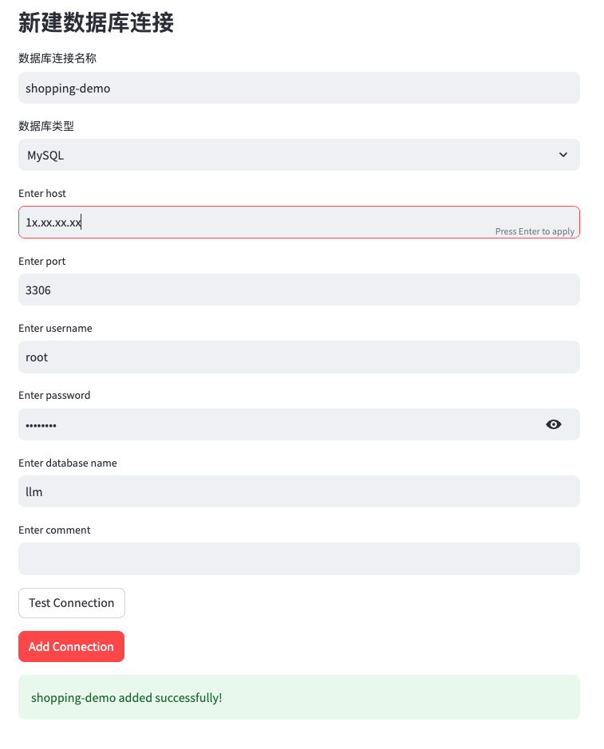
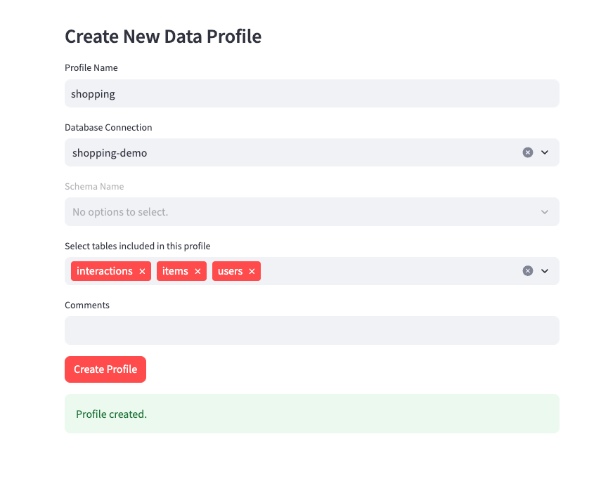
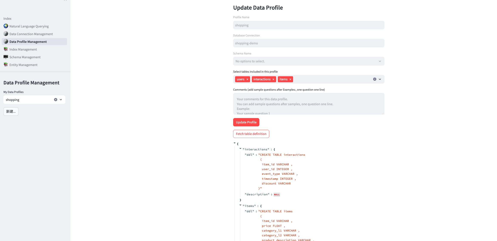
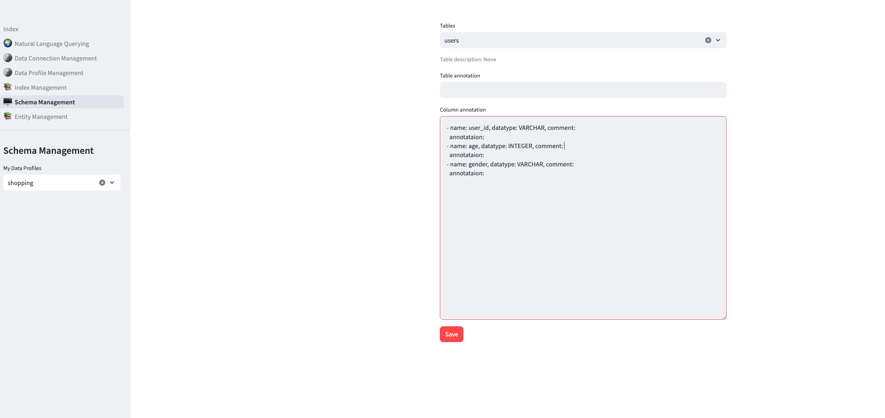
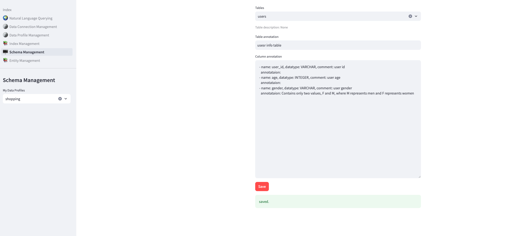

# 生成式BI演示应用

## 介绍

一个利用了Amazon Bedrock, Amazon OpenSearch服务和RAG技术来实现的NLQ(自然语言数据查询)演示应用


## 部署指南

### 1. 准备EC2实例
创建具有以下配置的EC2实例:

    - OS镜像(AMI): Amazon Linux 2023, Amazon Linux 2(AL2将在2025-06-30结束支持)
    - 实例类型: t3.large或更高配置
    - VPC: 使用默认的VPC并部署在公有子网
    - 安全组: 允许任何位置访问22, 80端口 (勾选允许来自以下对象的SSH流量和允许来自互联网的HTTP流量）
    - 存储(卷): 1个GP3卷 - 30 GiB

### 2. 配置权限

2.1 IAM Role的权限

创建一个新的IAM Role，名字为genbirag-service-role，具体设置为：
   - 信任实体：AWS服务
   - 服务： EC2
   - 使用场景：EC2 - Allows EC2 instances to call AWS services on your behalf.
跳过"添加权限", 先创建出这个Role。

当Role创建好之后，再通过创建内联策略来添加以下权限：
```json
{
    "Version": "2012-10-17",
    "Statement": [
        {
            "Sid": "VisualEditor0",
            "Effect": "Allow",
            "Action": [
                "bedrock:*",
                "dynamodb:*"
            ],
            "Resource": "*"
        }
    ]
}
```
最后为你的EC2实例绑定IAM角色, 可以参考[EC2文档-使用IAM角色](https://docs.aws.amazon.com/zh_cn/AWSEC2/latest/UserGuide/iam-roles-for-amazon-ec2.html#working-with-iam-roles)

2.2 Amazon Bedrock的模型访问权限

确保您已在us-west-2(美国西部(俄勒冈州))区域的AWS控制台中为Anthropic Claude模型和Amazon Titan嵌入模型启用了模型访问。


### 3. 安装Docker和Docker Compose
在EC2中，以ec2-user用户通过SSH命令行登录或者使用AWS EC2控制台的EC2 Instance Connect功能登录命令行，在会话下执行以下命令。

**注意：所有命令请一行一行执行。**

如果不是此用户,您可以使用以下命令切换:

```bash
sudo su - ec2-user
```

```bash
# 安装组件
sudo dnf install docker python3-pip git -y && pip3 install -U awscli && pip3 install docker-compose

# 对于 Amazon Linux 2，可以使用yum 替换 dnf

sudo yum install docker python3-pip git -y && pip3 install -U awscli && sudo pip3 install docker-compose

# 修复docker的python包装器7.0 SSL版本问题
pip3 install docker==6.1.3 

# 配置组件
sudo systemctl enable docker && sudo systemctl start docker && sudo usermod -aG docker $USER

# 退出终端
exit
```

### 4. 安装Demo应用

重新开启一个终端会话，继续执行以下命令:

注意：所有命令请一行一行执行。

```bash
# 以用户ec2-user作为登录用户

# 配置OpenSearch的服务器参数
sudo sh -c "echo 'vm.max_map_count=262144' > /etc/sysctl.conf" && sudo sysctl -p

# 克隆代码
git clone https://github.com/aws-samples/generative-bi-using-rag.git

# 在.env文件里配置环境变量，修改AWS_DEFAULT_REGION为你的EC2所在的区域
cd generative-bi-using-rag/application && cp .env.template .env 

# 在本地构建docker镜像
docker-compose build

# 启动所有服务
docker-compose up -d

# 等待3分钟，等MySQL和OpenSearch初始化完成
sleep 180
```

### 5. 初始化MySQL
在终端里继续执行以下命令:
```bash
cd initial_data && wget https://github.com/fengxu1211/generative-bi-using-rag/raw/demo_data/application/initial_data/init_mysql_db.sql.zip

unzip init_mysql_db.sql.zip && cd ..

docker exec nlq-mysql sh -c "mysql -u root -ppassword -D llm  < /opt/data/init_mysql_db.sql"
```

### 6. 初始化Amazon OpenSearch docker版本

6.1 通过创建新索引来初始化示例数据的索引
```bash
docker exec nlq-webserver python opensearch_deploy.py
```

如果脚本执行因任何错误而失败。 请使用以下命令删除索引并重新运行上一个命令。
```bash
curl -XDELETE -k -u admin:admin "https://localhost:9200/uba"
```

6.2 (可选)通过向已有索引追加数据(Append)来批量导入自定义QA数据
```bash
docker exec nlq-webserver python opensearch_deploy.py custom false
```

### 7. 访问Streamlit Web UI

在浏览器中打开网址: `http://<your-ec2-public-ip>` 

注意:使用 HTTP 而不是 HTTPS。

## Demo应用使用自定义数据源的方法
1. 先在Data Connection Management和Data Profile Management页面创建对应的Data Profile



2. 选择Data Profile后，开始提问，简单的问题，LLM能直接生成对的SQL，如果生成的SQL不对，可以尝试给Schema增加描述。



刷新这个页面，然后点击Fetch table definition



3. 使用Schema Management页面，选中Data Profile后，给表和字段都加上注释，这个注释会写进提示词发送给LLM。
   (1) 给一些字段的Annotation属性加上这个字段可能出现的值, 比如"Values: Y|N", "Values:上海市|江苏省"
   (2) 给表的注释加上能回答业务问题的领域知识






4. 重新提问，如果还是不能生成对的SQL，则添加Sample QA对到OpenSearch
   (1) 使用Index Management页面，选中Data Profile后，可以添加、浏览和删除QA问题对。

 
   
5. 再重新提问, 理论上通过RAG方式(PE使用Few shots)应该可以生成正确的SQL。

## Security

See [CONTRIBUTING](CONTRIBUTING.md#security-issue-notifications) for more information.

## License

This library is licensed under the MIT-0 License. See the LICENSE file.
